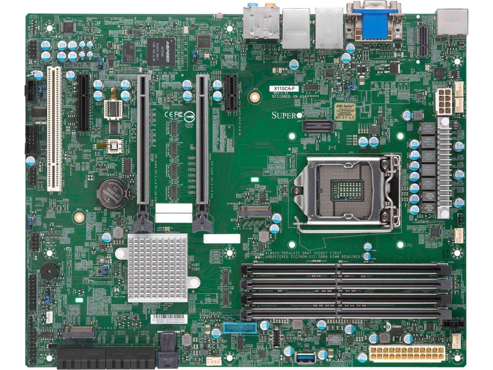
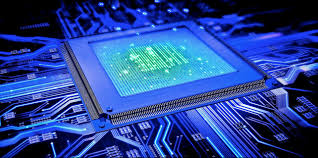
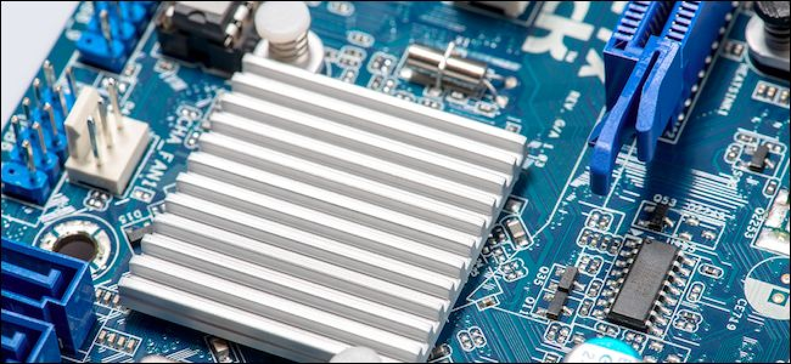
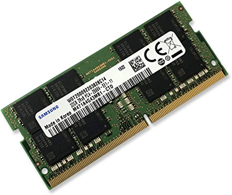
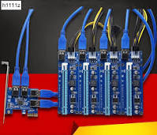
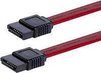
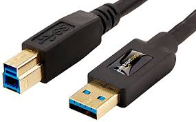
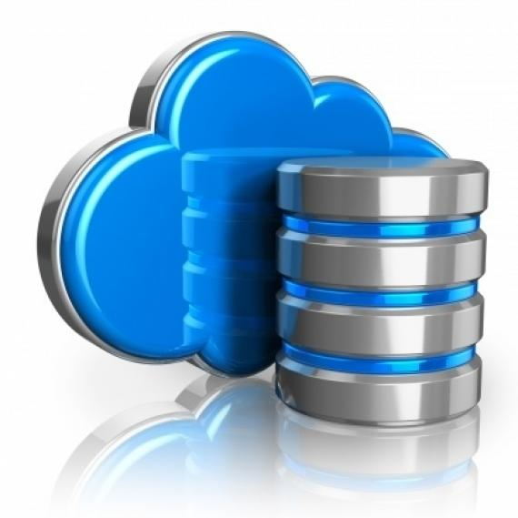
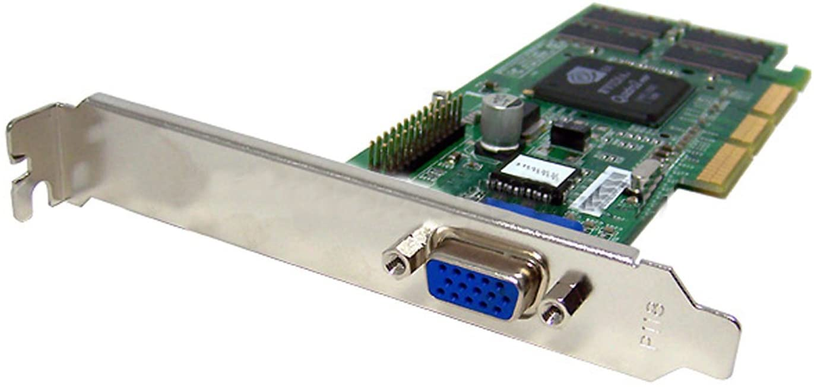
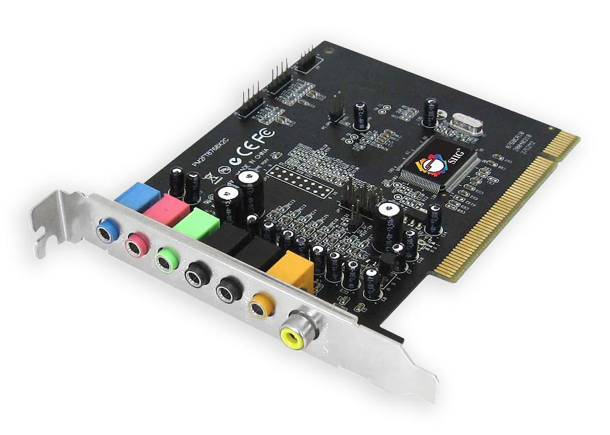

# Understanding Computer Architechture
# By: Damon Jennings
## While this was my first information technology course, I understood very little about the pieces that made up the computer itself.  This tutorial will hopefully give readers a cheatsheet to better understand what each component is, where it is located and the role which it plays within the computer structure.  The target audience is for beginners...let's get started!

> Motherboard

Holds and allows communication between many of the crucial electronic components of a system.

[Beginners Guide to Motherboards](https://youtube.com/watch?v=ZnaQyGAg8Eg&feature=youtu.be)

---------------------------------------------------------------------------------------------------------------------------------------

> Central Processing Unit

The electronic circuitry within a computer that carries out the instructions of a computer program by performing the basic arithmetic, logical, control and input/output operations specified by the instructions.

[How a CPU Works](https://youtube.com/watch?v=cNN_tTXABUA&feature=youtu.be)

--------------------------------------------------------------------------------------------------------------------------------------

> Chipset

Composed of two chips, Northbridge and Southbridge, found in the core logic chipset architecture on a PC motherboard.  These two chips manage communications between the CPU and other parts of the motherboard.

[What is Chipset?](https://youtube.com/watch?v=eJm-qPHtfzl&feature=youtu.be)

--------------------------------------------------------------------------------------------------------------------------------------

>Random Access Memory (RAM)

RAM is a from of computer data storage that stores data and machine code currently being used.

[RAM Explained](https://youtube.com/watch?v=PVad0c2cljo&feature=youtu.be)

--------------------------------------------------------------------------------------------------------------------------------------

> PCI Express (PCIe)

Peripheral Component Interconnect Express is a high-speed serial computer expansion bus standard with higher maximum system bus throughput, lower input and output count with a smaller physical footprint.

[PCI Express Explained](https://youtube.com/watch?v=LSSHuMHbCWo&feature=youtu.be)

--------------------------------------------------------------------------------------------------------------------------------------

>Serial Advanced Technology Attachment (SATA)

SATA is a computer bus interface that connects host bus adapters to mass storage devices such as hard disk drives, optical drives, and solid-state drives.

[Understanding SATA](https://youtube.com/watch?v=N7FmrnUU4Y8&feature=youtu.be)

---------------------------------------------------------------------------------------------------------------------------------------

> Universial Serial Bus (USB)

Universial serial bus is an industry standard that was developed to define cables, connectors and protocols for connection, communication, and power supply between person computers and their peripheral devices.

[Explaning USB](https://youtube.com/watch?v=C-N_vN_tmA0&feature=youtu.be)

----------------------------------------------------------------------------------------------------------------------------------------

> Data Storage

Data Storage is the recording of information in a storage medim.  Recording is accomplished by virtually any form of energy and is one of the core functions of a general purpose computer.

---------------------------------------------------------------------------------------------------------------------------------------

> Video Card

Video cards are an expansion card which gnerates a feed of output images to a display, i.e. computer monitor.  

[How do Graphic Cards Work](https://youtube.com/watch?v=ZfnPFNnXqC0&feature=youtu.be)

----------------------------------------------------------------------------------------------------------------------------------------

> Sound Card

A sound card is an internal expansion card that provides input and output of audio signals to and from a computer under control of computer programs.

[Do You Need a Sound Card?](https://youtube.com/watch?v=SFBvvlebSmw&feature=youtu.be)

----------------------------------------------------------------------------------------------------------------------------------------

